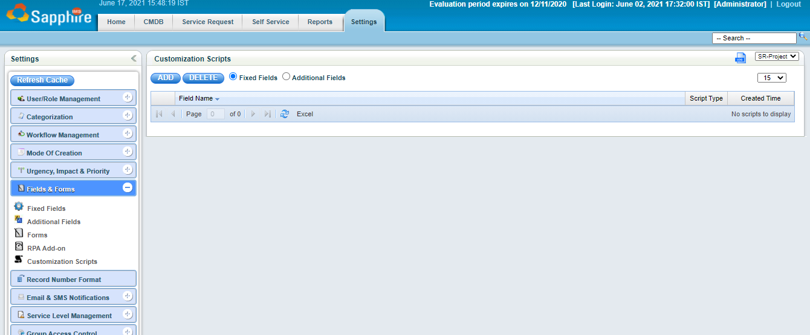
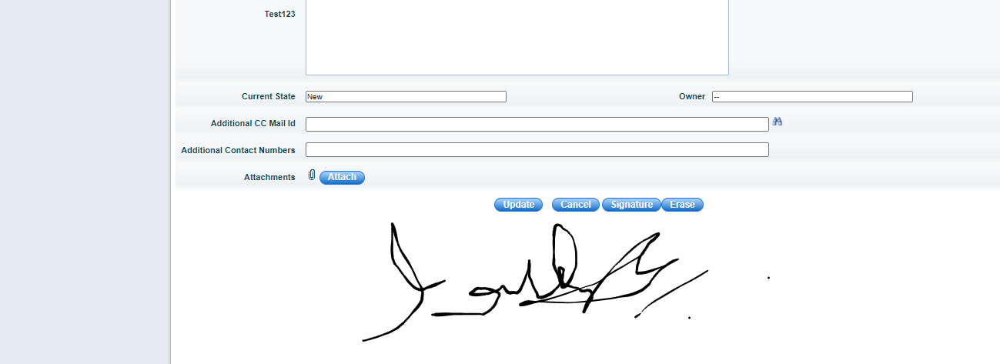
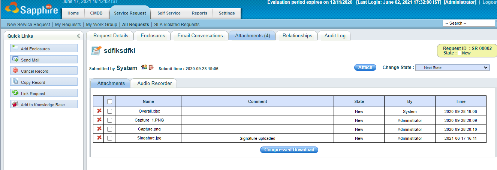

Use case:  User’s signature is very important to be captured as a business process. 

You may be thinking it will be a complex development. No, it’s not a complex development, if you are using SapphireIMS, I am going to show you how it can be integrated with 30min. Yes, you heard right less than 30min.

We are going to use open-source signature pad library in our integration – Please refer following URL for more detail “<https://github.com/szimek/signature_pad>”. You no need to download anything we are going to use CDN for the script. 

CDN URL is “<https://cdn.jsdelivr.net/npm/signature_pad@2.3.2/dist/signature_pad.min.js>”.

Let start integrating signature pad with SapphireIMS.

Navigate to SapphireIMS -> Service Desk -> Settings -> Select a Project -> fields & forms -> Customization Scripts

Click Add – To create a new custom script

Choose UI Type as Classic View Editor

Choose Field as All (onLoad)

Action as Load

Script Type as Text

That’s it, let us start some basic coding.

First we have to load the script from CDN, we will be using JQuery & java script in our scripting

Let us start writing the code.

|
// First we have to load the script from CDN, we will be using JQuery & java script in our scripting

jQuery.getScript( "https://cdn.jsdelivr.net/npm/signature\_pad@2.3.2/dist/signature\_pad.min.js", function( data, textStatus, jqxhr ) {

  

`  `// Append button two buttons with in SapphireIMS Edit Record page

`  `// 1. Signature Button to get the signature as image and uploading as attachment as part of the record

`  `// 2. Erase the signature if it is wrongly signed.

`  `// 

`  `// We are going to use insertAfter - get the id after cancel button from the Edit Record Page, i.e, readOnly

`  `// 

`  `jQuery("&nbsp;  &nbsp;<input id='signatureBTN' name='signatureBTN' type='button' value='Signature' class='addbuttons'>").insertAfter("#readOnly");

`  `jQuery("&nbsp;  &nbsp;<input id='erase' name='erase' type='button' value='Erase' class='addbuttons'>").insertAfter("#signatureBTN");

`  `// Add a canvas to the edit record after our last button erase which has been created. 

`  `jQuery("
<canvas id='signature-pad' class='signature-pad' width=900 height=200></canvas>
").insertAfter("#erase");

  

`  `// Get the canvas element

`  `var canvas = document.getElementById('signature-pad');

  

`  `// Create signaturePad element and by using canvas

`  `var signaturePad = new SignaturePad(canvas, {

`    `backgroundColor: 'rgb(255, 255, 255)' // necessary for saving image as JPEG; can be removed is only saving as PNG or SVG

`  `});

`  `// Now we are ready with UI elements and it is rendering on our Edit Record page, time to write some actions

`  `// Register a click event to clear the signature pad

`  `document.getElementById('erase').addEventListener('click', function () {

`    `signaturePad.clear();

`  `});

`  `// Util method to get the csrf token from the current request for uploading 

`  `function getMeta(metaName) {

`    `const metas = document.getElementsByTagName('meta');

`    `for (let i = 0; i < metas.length; i++) {

`        `if (metas[i].getAttribute('name') === metaName) {

`            `return metas[i].getAttribute('content');

`        `}

`    `}

`    `return '';

`  `}

`  `// Util method to convert the data uri from signature pad to Blob for upload as a binary file.

`  `function DataURIToBlob(dataURI) {

`    `const splitDataURI = dataURI.split(',');

`    `const byteString = splitDataURI[0].indexOf('base64') >= 0 ? atob(splitDataURI[1]) : decodeURI(splitDataURI[1]);

`    `const mimeString = splitDataURI[0].split(':')[1].split(';')[0];

`    `const ia = new Uint8Array(byteString.length);

`    `for (let i = 0; i < byteString.length; i++)

`        `ia[i] = byteString.charCodeAt(i);

`    `return new Blob([ia], { type: mimeString });

`  `}

`   `// Final event register for signature button to upload as part of the record

`  `document.getElementById('signatureBTN').addEventListener('click', function()

`  `{

`    `if (signaturePad.isEmpty()) {

`        `return alert("Please provide a signature first.");

`    `}

        

`    `var dataURL = signaturePad.toDataURL('image/jpeg');

`    `var fd = new FormData();

`    `fd.append('upload', DataURIToBlob(dataURL), 'Singature.jpg');

`    `fd.append('commentArea', "Signature uploaded");

         

`    `jQuery.ajax({

`                    `type: "POST",

`                    `data: fd,

`                    `processData: false,

`                    `contentType: false,

`                    `url: "Upload?\_csrf="+getMeta('\_csrf')+'&problemID='+document.getElementById("ticketid").value

`                `}).done(function(o) {

`                    `console.log('saved');

`                `});  

`    `});

});
|
| :- |

